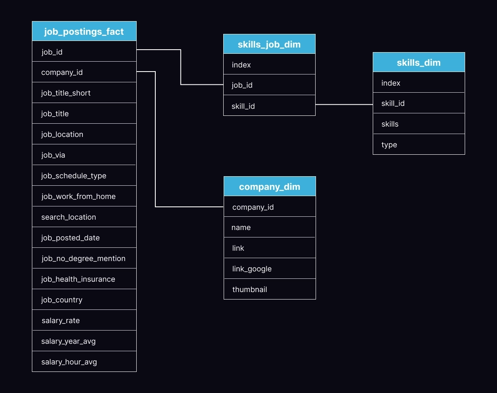
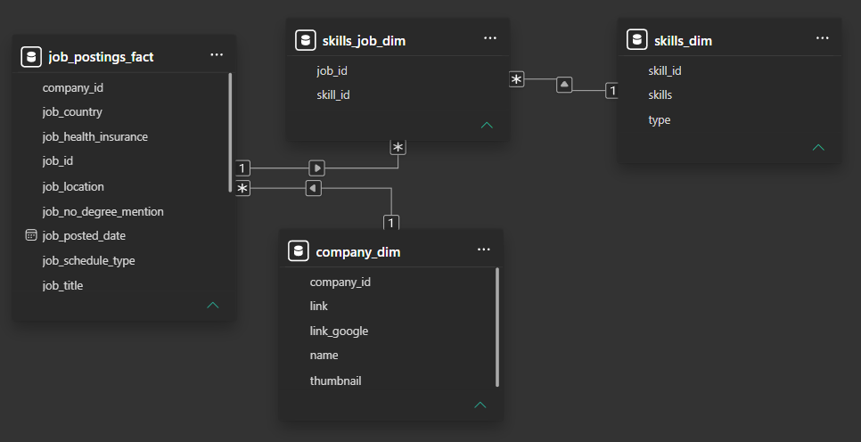
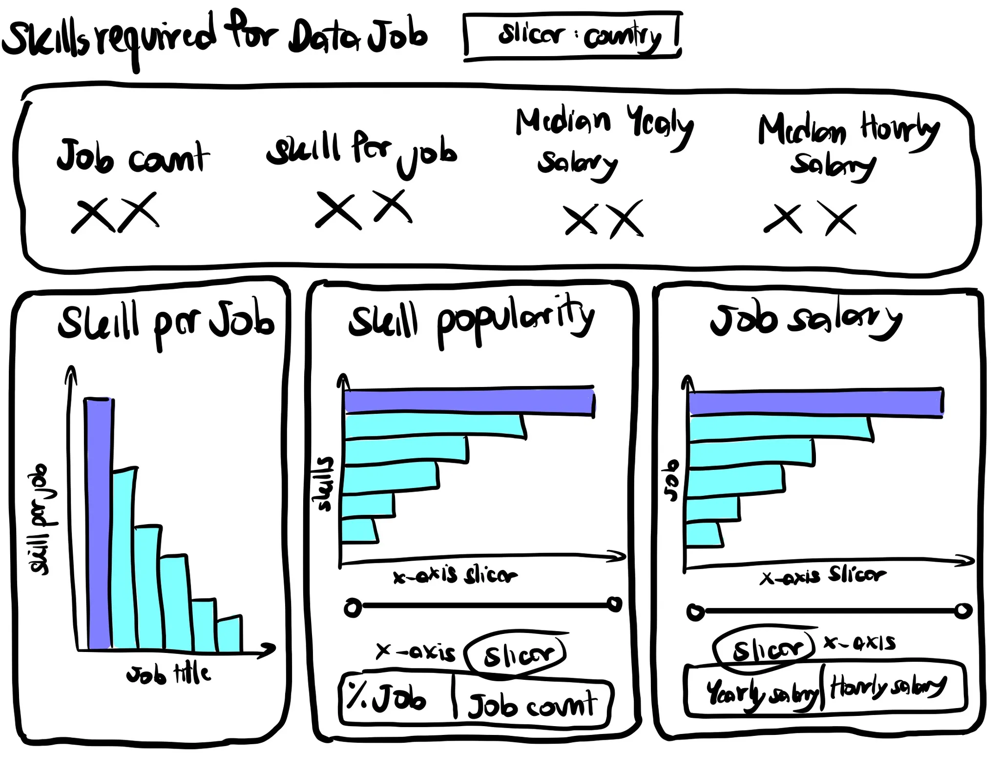
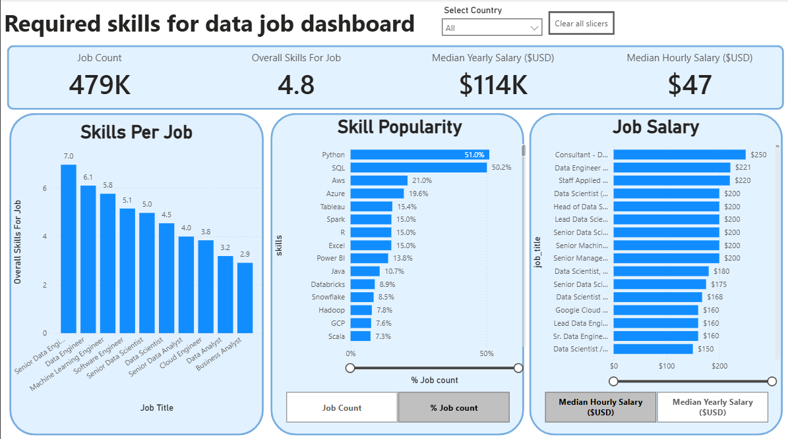

# Introduction
This dashboard helps job seekers and career changers explore the data job market using 2024 job posting data. It provides insights into job demand, salaries, and locations through an interactive and easy-to-use Power BI dashboard.

Check the Power BI dashboard : [**Data_Job_Dashboard**](Data_Job_Dashboard.pbix)

# Background
This project aim to gain the perspective of data job that I am transitioning into. My goal is to derive additional information regarding data job, including : **Required skill for data job**, and **The most popular skill**

The dataset in this project is from [**Link**](https://drive.google.com/drive/folders/1DWmAUNAuamqinMvpQiko_bZzXKG7JEr5)

# The question I want to answer
## Who am I designing this for
- **Job Seekers**
- **Job Transitioners**
- **Job Swappers**

## What problem am I trying to solve ?
- **Those looking for data roles often struggle because information about the job market is scattered.**
- **There's no single, easy way to quickly grasp the overall trends of the market, typical compensation levels, and general job quality.**

# Tool I used
To accomplish this project. I am equipped with powerful several key tools ;
- **Power BI** : The main tool for dashboard, allowing me to visualize the data and discover critical insights.
- **Visual Studio Code** : My file management tool for version control and sharing the project file to Github .
- **Git & GitHub** : Essential for version control and sharing my project file including Power BI file, ensuring collaboration and project tracking.

# ERD of the tables

*Graphic of Entity relatationship diagram (ERD) in the star schema format.*

*Entity relatationship diagram (ERD) in Model view in Power BI in the star schema format.*

# Dashboard layout
## Planning
### Page 1 : Skills required for data job

Below is the layout of the dashboard named "Skills required for data job" that consists of the slicer for the users to select the country based on their interest, the overall job detail (Job count, Skill per Job, Median hourly salary, Median yearly salary) and the 3 main graphs for detailed view of those skill and job title

## Designing
### Page 1 : Skills required for data job
This is the finished look of the dashboard page. On the upper section, user can select the country and to filter the job title or skill based on their interest.

This dashboard helps provide the skills that job transitioner or the person in data job need to focus on that is most required by each job.

# What I Learned
This project put key Power BI features into practice. Here's what we mastered:

- **Dashboard Design** : Created an intuitive and visually engaging dashboard layout.
- **Data Transformation (Power Query)** : Cleaned, transformed, and prepared raw data for analysis.
- **Data Modeling** : Developed relationships between tables using star schema principles.
- **DAX & Measures** : Built calculations and KPIs to generate meaningful insights.
- **Data Visualization** : Utilized column, bar, line, area, map, card, and table visuals to communicate trends and metrics effectively.
- **Data Storytelling** : Selected appropriate chart types to present insights clearly and support decision-making.
- **Interactive Reporting** : Implemented slicers, buttons, bookmarks, and drill-through functionality to enhance user exploration and navigation.

# Conclusions
By building this dashboard, I gained practical experience in Power BI and learned how to turn raw data into clear, actionable insights through effective visualization and reporting.

## Insights
* Clean and well-structured data is essential for accurate analysis and reporting.
* Effective data modeling improves report performance and simplifies analysis.
* Different chart types serve different purposes and enhance data storytelling.
* Interactive features such as slicers and drill-through enable deeper data exploration.
* Power BI combines data preparation, analysis, and visualization into a powerful decision-making tool.

## Final Takeaway
This project reinforced my ability to transform raw data into actionable insights using Power BI, while strengthening my skills in data analysis, visualization, and dashboard development.

## Closing Thoughts
This project marks an important step in my data analytics journey, allowing me to apply Power BI concepts in a real-world scenario while developing practical skills in data visualization and storytelling.